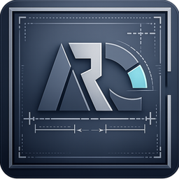

# A.R.C. Frame — Калькулятор москитных сеток

<p align="center">
  
</p>

<p align="center">
  <strong>Десктопное WPF-приложение для расчёта стоимости москитных сеток, откосов и сопутствующих товаров.</strong>
</p>

<p align="center">
  
  
  
  
</p>

---

## Содержание

- [О проекте](#о-проекте)
- [Скриншоты](#скриншоты)
- [Возможности](#возможности)
- [Технологический стек](#технологический-стек)
- [Требования](#требования)
- [Сборка и запуск](#сборка-и-запуск)
- [Тестирование](#тестирование)
- [Структура проекта](#структура-проекта)
- [Архитектура и A.R.C.](#архитектура-и-arc)
- [Разработка](#разработка)
- [Лицензия](#лицензия)

История изменений: [CHANGELOG.md](CHANGELOG.md).

---

## О проекте

**A.R.C. Frame** — это десктопное приложение на C# / WPF для расчёта стоимости москитных сеток и сопутствующих товаров (отливы, козырьки, короба, уплотнения, откосы и др.).

Приложение предназначено для менеджеров по продажам и замерщиков, которые на объекте или в офисе быстро считают стоимость заказа и формируют коммерческое предложение (КП) для клиента.

### Основной сценарий работы

1. Выберите товар (Anwis, Отлив, Козырёк, ПСУЛ, Откос и т.д.).
2. Укажите размеры (ширину, высоту), цвет, количество.
3. Система автоматически рассчитывает площадь/периметр/количество и стоимость.
4. Добавляйте позиции — общая сумма пересчитывается в реальном времени.
5. Заполните данные заказчика (имя, телефон, адрес, номер договора).
6. Сформируйте КП — печать или сохранение в PDF.
7. При необходимости сформируйте текст для отправки на завод/производство.
8. Сохраните заказ в историю, откуда его можно открыть, экспортировать или удалить.

---

## Скриншоты

> **Примечание:** скриншоты будут добавлены в следующем релизе. Для обновления поместите файлы `screenshot-main.png` и `screenshot-print-preview.png` в папку `docs/images/`.

<p align="center">
  <strong>Главное окно приложения</strong> — панель расчёта, история заказов и slide-out навигация.
  <br><br>
  <code>docs/images/screenshot-main.png</code>
</p>

<p align="center">
  <strong>Предпросмотр печатного КП</strong> — нативный WPF-рендеринг, зум и печать.
  <br><br>
  <code>docs/images/screenshot-print-preview.png</code>
</p>

---

## Возможности

- **Расчёт стоимости** — автоматический пересчёт по формулам для каждого типа товара.
- **Режимы размера Anwis** — 5 режимов (ББ 60, ББ 70, ПП, Проём, Габарит) с коррекцией размеров.
- **Коммерческое предложение** — `FlowDocument` с SVG-чертежами, печать через `PrintQueueManager`, экспорт в PDF через `PdfExportService`.
- **Отправка на завод** — формирование структурированного текста с размерами для производства.
- **История заказов** — сохранение, загрузка, экспорт/импорт, сортировка, поиск.
- **Доп. КП** — возможность прикреплять дополнительные коммерческие предложения.
- **Автообновление** — проверка и установка новых версий через GitHub Releases.
- **Тёмная тема** — полноценная тёмная тема оформления с мгновенным переключением.
- **Undo/Redo** — отмена и повтор изменений (Ctrl+Z / Ctrl+Y).
- **Автопросчёт откосов** — расчёт материалов (сэндвич, пена, герметик, Старт/F-планка, пеноплекс) по размерам окна с учётом экономии.

---

## Технологический стек

| Компонент | Технология |
|-----------|-----------|
| Язык | C# 12 |
| Фреймворк | .NET 8 |
| UI | WPF (Windows Presentation Foundation) |
| Тип приложения | WinExe, single-file publish |
| Целевая ОС | Windows 10/11 |
| Архитектура | win-x64 |
| PDF-экспорт | QuestPDF 2024.7.0 |
| Тестирование | xUnit (STA tests) |

---

## Требования

- Windows 10 (версия 1809 или новее) / Windows 11
- [.NET 8.0 SDK](https://dotnet.microsoft.com/download/dotnet/8.0) (для сборки из исходников)
- [.NET 8.0 Desktop Runtime](https://dotnet.microsoft.com/download/dotnet/8.0) (для запуска не-self-contained сборки; релизная `build.bat` публикует self-contained EXE, runtime не требуется)
- Visual Studio 2022 или JetBrains Rider / VS Code (опционально)

---

## Сборка и запуск

### CI/CD

Проект использует GitHub Actions:

- **`.github/workflows/ci.yml`** — сборка и тесты на каждый push/PR в `main`.
- **`.github/workflows/release.yml`** — автоматическая сборка, создание GitHub Release и обновление `releases.json` при push тега `vX.Y.Z`.

Чтобы опубликовать релиз:

```bash
# Обновите <Version> в MosquitoNetCalculator/MosquitoNetCalculator.csproj
# Обновите CHANGELOG.md, update-log.json и releases.json (заглушка записи)
git add .
git commit -m "release: v3.X.Y"
git tag v3.X.Y
git push origin main --tags
```

Workflow `release.yml` выполнит остальное: соберёт single-file EXE, создаст ZIP, вычислит SHA-256, опубликует GitHub Release и обновит `releases.json` в `main`.

### Скачать готовый релиз

Последняя версия всегда доступна на [GitHub Releases](https://github.com/DdepRest/arc-frame/releases/latest).

### Быстрая разработка

```bat
:: Сборка в Debug и запуск приложения
dev.bat
```

### Релизная сборка

```bat
:: Полная релизная сборка с публикацией в папку publish/
build.bat
```

Скрипт `build.bat` выполняет:

1. Очистку старых артефактов (`publish/`, `bin/`, `obj/`).
2. Восстановление NuGet-пакетов.
3. Публикацию single-file приложения для `win-x64`.
4. Копирование `prices.json`, иконки и вспомогательных файлов.
5. Создание ZIP-архива для GitHub Releases.
6. Запуск приложения из `publish\MosquitoNetCalculator.exe`.

### Ручная сборка

```bat
:: Восстановление пакетов
dotnet restore MosquitoNetCalculator/MosquitoNetCalculator.csproj

:: Сборка в Release
dotnet build MosquitoNetCalculator/MosquitoNetCalculator.csproj -c Release

:: Публикация single-file приложения
dotnet publish MosquitoNetCalculator/MosquitoNetCalculator.csproj ^
  -c Release -r win-x64 --self-contained ^
  -p:PublishSingleFile=true ^
  -p:EnableCompressionInSingleFile=true ^
  -o publish
```

---

## Тестирование

Проект покрыт юнит- и STA-тестами (1195 тестов, 100 % проходят).

```bat
:: Запуск всех тестов
dotnet test MosquitoNetCalculator.Tests/MosquitoNetCalculator.Tests.csproj -c Release

:: Запуск без восстановления пакетов
dotnet test MosquitoNetCalculator.Tests/MosquitoNetCalculator.Tests.csproj -c Release --no-restore
```

Также доступны вспомогательные PowerShell-скрипты:

- `validate-docs.ps1` — проверка консистентности документации.
- `arc-check.ps1` — pre-commit проверка синхронизации документов.
- `gensymbols.ps1` — перегенерация `SYMBOL_INDEX.md`.

---

## Структура проекта

```text
gwga/
├── MosquitoNetCalculator/              # Основное приложение
│   ├── App.xaml                        # Точка входа, ресурсы, темы
│   ├── MainWindow.xaml + .cs           # Главное окно (partial-классы)
│   ├── Controls/                       # WPF-контролы и окна
│   ├── Converters/                   # IValueConverter
│   ├── Helpers/                      # Вспомогательные классы
│   ├── Models/                       # Доменные модели и DTO
│   ├── Services/                     # Бизнес-логика и инфраструктура
│   ├── Themes/                       # XAML-ресурсы стилей
│   ├── ViewModels/                   # ViewModel'и
│   └── Resources/                    # Иконки, update-log.json
├── MosquitoNetCalculator.Tests/        # Юнит- и STA-тесты
├── docs/                               # Документация
│   ├── arc/                          # Архитектурная документация (A.R.C.)
│   ├── USER_GUIDE.md                 # Руководство пользователя
│   └── USER_GUIDE.html               # HTML-версия руководства
├── build.bat                           # Релизная сборка
├── dev.bat                             # Dev-запуск
├── installer.iss                       # Inno Setup скрипт установщика
├── releases.json                       # Манифест релизов
└── README.md                           # Этот файл
```

---

## Архитектура и A.R.C.

Приложение построено вокруг главного окна `MainWindow`, которое координирует несколько overlay-панелей (Заказы, Цены, Обновления, Откосы, Заказчик, Печать). UI-логика разделена на слои:

| Слой | Роль |
|---|---|
| **Views (XAML + code-behind)** | `MainWindow`, `Controls/*`, `Themes/*` — визуализация |
| **ViewModels** | `MainWindowViewModel`, `CalculationViewModel`, `OrdersHistoryViewModel`, `PricesViewModel` — состояние экранов |
| **Services** | Бизнес-логика, IO, печать, автообновление, диалоги |
| **Models** | `OrderData`, `OrderItem`, `AnwisSize`, `SlopeCalculation` и др. |
| **Tests** | Юнит + STA + интеграционные тесты |

### Системный рефакторинг

Проект прошёл 6 фаз рефакторинга, направленных на устранение God-classes и снижение связанности:

| Фаза | Что выделено | Эффект |
|---|---|---|
| 1 | `NavigationService`, `OverlayManager`, `SlopeOverlayCoordinator`, `SlopesProUpsellGate` | `MainWindow.xaml.cs`: 1051 → 760 строк |
| 2 | `VersionResolver`, `IdleDetector`, `UpdateVerifier`, `UpdateManifestClient`, `UpdateDownloader` | `UpdateService.cs`: 910 → 608 строк |
| 3 | `DrawingService`, `FlowDocumentBuilder`, `FixedDocumentBuilder`, `PrintQueueManager`, `PdfExportService` | `PrintService.cs`: 632 → 81 строк |
| 4 | XAML-шаблоны диалогов + `DialogBuilder` | `DialogService.cs`: 641 → ~250 строк |
| 5 | `ProductCatalog`, `AnwisSizeCalculator`, `SlopeCalculationExtensions` | `OrderItem.cs`: 651 → ~520 строк |
| 6 | `OrderGridPresenter`, `OrderImportExportService`, `ChangeOrderStatusWindow` | `MainWindow.Orders.cs`: 527 → 226 строк |

### A.R.C. (Agent-Ready Code)

Проект использует систему архитектурной документации A.R.C.:

- `docs/arc/CHEATSHEET.md` — быстрый вход (критические правила + routing).
- `docs/arc/MULTI_AGENT_ARC_CALC_CONTROL.md` — канонический source of truth.
- `docs/arc/DOCUMENTATION_MATRIX.md` — карта «файл → документы».
- `docs/arc/SYMBOL_INDEX.md` — индекс символов проекта.
- `docs/arc/INTENTS.md` — routing фраз на файлы.
- `validate-docs.ps1` — автоматическая валидация консистентности.

---

## Разработка

### Важные правила

1. **Расчёты стоимости** — любая ошибка = неправильная цена для клиента.
2. **Формулы Anwis** — сложная логика коррекции размеров, легко допустить утечку формул на не-Anwis товары.
3. **Печать КП** — клиент видит именно этот документ.
4. **Отправка на завод** — производство работает по этим размерам.
5. **Автообновление** — если сломать, пользователи не получат исправления.
6. **Сохранение заказов** — данные клиентов и расчёты должны сохраняться надёжно.

### Полезные команды

```bat
:: Проверка документации
powershell -ExecutionPolicy Bypass -File validate-docs.ps1

:: Pre-commit проверка
powershell -ExecutionPolicy Bypass -File arc-check.ps1

:: Перегенерация индекса символов
powershell -ExecutionPolicy Bypass -File gensymbols.ps1
```

---

## Лицензия

[MIT](LICENSE) © 2026 DdepRest.

---

<p align="center">
  <em>Built with ❤️ for A.R.C. Frame team.</em>
</p>
